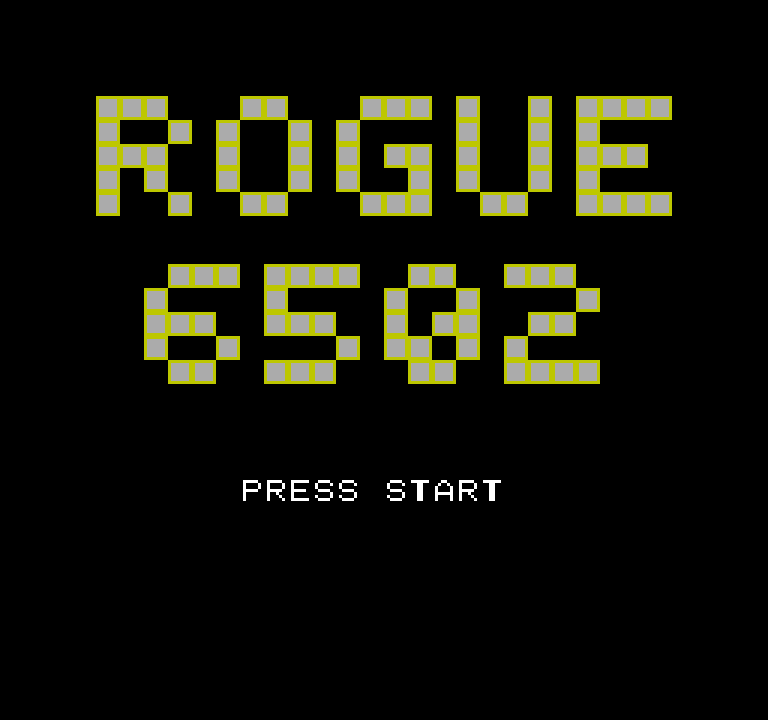

# ROGUE 6502

A roguelike dungeon crawler for the NES, written in 6502 assembly.

**[⬇ Download `rogue-nes.nes`](https://github.com/djessemann/rogue-nes/raw/main/rogue-nes.nes)** — run it in any NES emulator.

## Acknowledgements

Inspired by *Rogue* (1980), created by Michael Toy and Glenn Wichman with later
contributions by Ken Arnold. This is an original, from-scratch implementation and
includes no code from the original game, whose 5.x source is separately available
under a BSD 3-Clause license (© 1980–1983, 1985, 1999 Michael Toy, Ken Arnold, and
Glenn Wichman).
